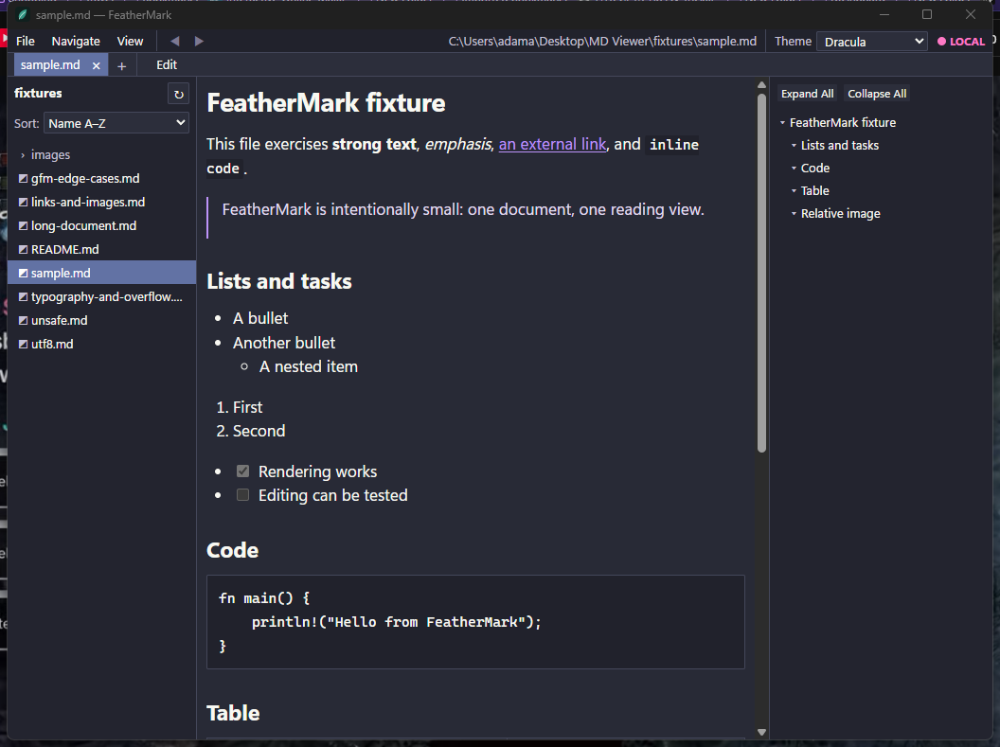
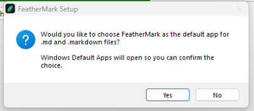
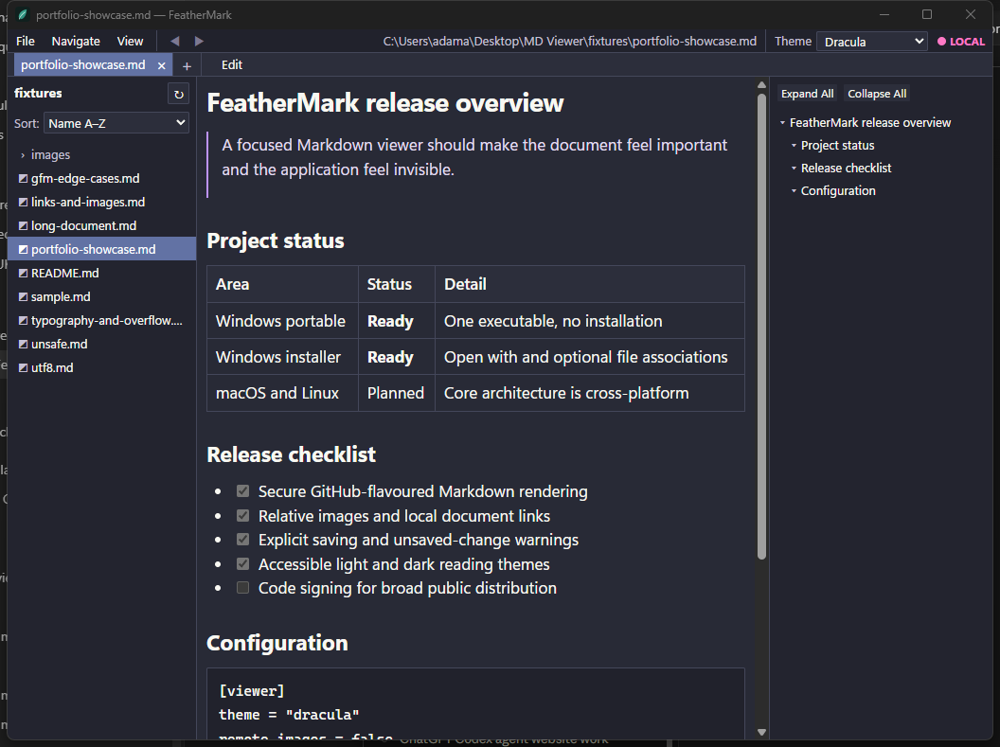
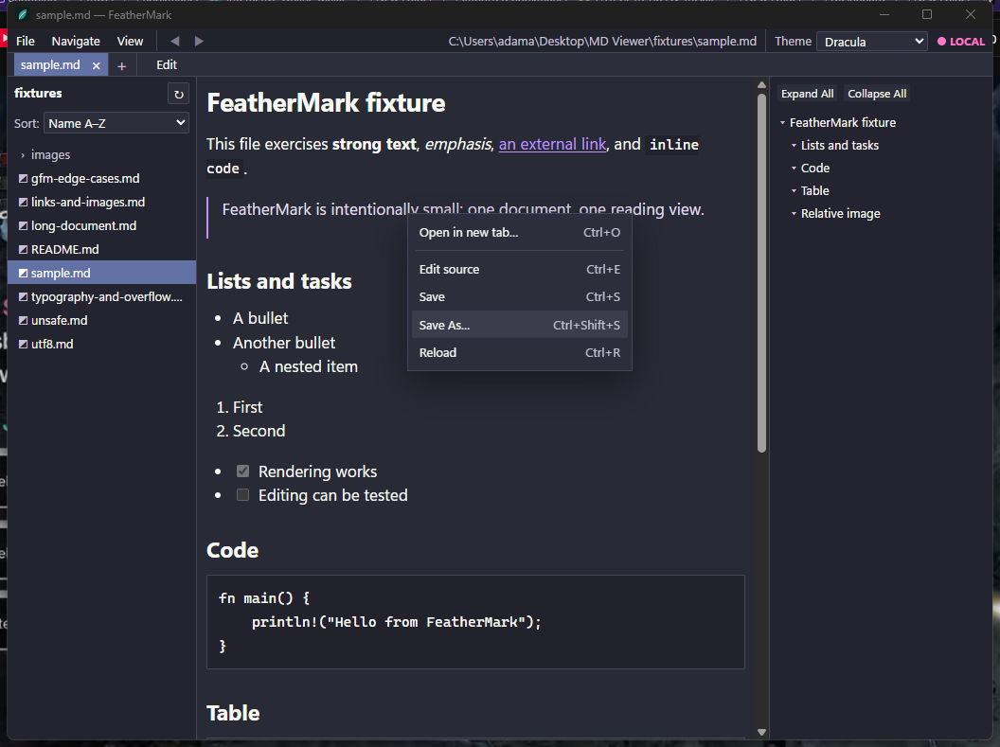

<p align="center">
  
</p>

<h1 align="center">FeatherMark</h1>

<p align="center">
  A small, fast, security-conscious Markdown viewer for Windows.
</p>

<p align="center">
  <a href="https://github.com/Complicatons/FeatherMark/actions/workflows/ci.yml"></a>
  
  
  
  
</p>

<p align="center">
  <a href="#download">Download</a> ·
  <a href="#why-feathermark">Why FeatherMark</a> ·
  <a href="#features">Features</a> ·
  <a href="#keyboard-shortcuts">Shortcuts</a> ·
  <a href="#build-from-source">Build</a> ·
  <a href="PORTFOLIO.md">Case study</a> ·
  <a href="#security">Security</a>
</p>



FeatherMark opens local Markdown files quickly and gets out of the way. It is a viewer first, with a deliberately basic source editor for small corrections. There are no accounts, databases, cloud features, telemetry, bundled browser engines, background services, plugin systems, or automatic updates.

## Why FeatherMark

Many Markdown applications grow into note platforms, IDEs, or knowledge-management systems. FeatherMark explores the opposite direction: how small and focused can a practical desktop Markdown viewer remain while still handling the everyday details well?

That constraint shaped every decision. FeatherMark uses Rust for trusted file and state handling, the operating system's existing WebView instead of shipping a browser runtime, and a dependency-free interface. Editing is intentionally a single raw-source view. Tabs share one renderer. Remote content is blocked by default. The result is a portable Windows executable of roughly 9.13 MiB that opens quickly, feels like a desktop utility, and remains structured for future macOS and Linux builds.

### Engineering decisions

| Challenge | Decision | Result |
| --- | --- | --- |
| Keep the download small | Tauri 2 with the installed WebView2 runtime | No bundled Chromium or background service |
| Render untrusted Markdown safely | Escape raw HTML, validate links in Rust, confine local image paths, and enforce a strict CSP | Documents cannot run arbitrary JavaScript or silently fetch remote images |
| Add tabs without turning the app into a browser | Keep document state in Rust and reuse one WebView and one rendered surface | Multiple files with a small incremental memory cost |
| Support quick corrections without becoming an editor suite | Plain-text source/preview toggle, debounced rendering, explicit saves, and dirty-state warnings | Useful editing with little interface or dependency overhead |
| Ship both portable and installed editions | Isolate Windows packaging and file-association hooks from core application logic | One-file portable use plus an optional native installation path |

> [!NOTE]
> FeatherMark 0.1.0 is Windows-first. macOS and Linux remain architectural targets, but their builds and packages have not yet been verified.

## Download

The latest Windows release provides two x64 downloads on the repository's [**Releases** page](../../releases):

| Download | Best for | Behaviour |
| --- | --- | --- |
| `FeatherMark-0.1.0-windows-x64-portable.exe` | USB drives and no-install use | One executable; no installation or file-association registration. Keep `portable` in the filename to suppress FeatherMark preference writes. |
| `FeatherMark-0.1.0-windows-x64-setup.exe` | Normal desktop use | Per-user installation, Start menu shortcut, uninstall entry, Windows **Open with** registration, and optional `.md` / `.markdown` default association. |

The installed version appears in Windows **Open with** and adds **Open with FeatherMark** to the standard file context menu for `.md` and `.markdown` documents. On Windows 11, classic desktop commands can appear under **Show more options**. The installer also asks whether to open Windows Default Apps so the user can confirm FeatherMark as the Markdown default; it never silently takes over file associations.

### Install FeatherMark

**Standard installer**

1. Download `FeatherMark-0.1.0-windows-x64-setup.exe` from [Releases](../../releases).
2. Run the installer. FeatherMark is installed for the current Windows user; administrator access is not required.
3. At the end, choose whether to open Windows Default Apps and select FeatherMark for `.md` and `.markdown` if desired.
4. Open Markdown files from the Start menu, Windows **Open with**, the file context menu, or by double-clicking an associated file.

**Portable edition**

1. Download `FeatherMark-0.1.0-windows-x64-portable.exe` from [Releases](../../releases).
2. Keep `portable` in the filename and place the executable wherever you want.
3. Run it directly or drag a Markdown file onto it. Nothing is installed and FeatherMark does not register file associations or write its own preference file.

<p align="center">
  
</p>

### Requirements

- Windows 10 or Windows 11, x64.
- Microsoft WebView2 Runtime. The installer fetches the small Microsoft bootstrapper when the shared runtime is missing.

The current binaries are not code-signed. Windows SmartScreen may therefore show an unknown-publisher warning when they are downloaded from the internet. Code signing is the main remaining step before a polished broad public release.

## Features

- Fast native-window startup with a compact Rust host.
- GitHub-flavoured Markdown essentials: headings, emphasis, lists, links, images, blockquotes, inline and fenced code, tables, task lists, footnotes, strikethrough, and horizontal rules.
- Lightweight tabs backed by one shared rendered view rather than one WebView per document.
- Shallow file panel and generated document outline.
- Relative Markdown links and safe local images resolved from the document directory.
- Always-visible theme dropdown with Dracula as the first-run default, plus System, Feather Light/Dark, GitHub Light/Dark, Nord, Solarized Light/Dark, and Sepia palettes.
- Right-click document and tab menus with direct Edit/Preview, Save, Save As, Reload, and Open actions.
- Plain-text source mode with debounced preview and explicit Save / Save As.
- Unsaved-change warnings before destructive navigation or closing.
- File picker, command-line opening, drag and drop, Windows **Open with**, a Markdown context-menu command, and optional default file associations.
- Clean maximum-width reading layout with Unicode-friendly system font fallbacks.



<p align="center">
  
</p>

<p align="center"><em>Core document actions stay close at hand without turning the reading view into a toolbar-heavy editor.</em></p>

FeatherMark intentionally does **not** include rich-text editing, recursive vault management, session restoration, sync, accounts, Git integration, AI features, export systems, Mermaid, LaTeX, plugins, or an updater.

## Keyboard shortcuts

| Shortcut | Action |
| --- | --- |
| <kbd>Ctrl</kbd> + <kbd>O</kbd> | Open a Markdown file |
| <kbd>Ctrl</kbd> + <kbd>T</kbd> | Open another document |
| <kbd>Ctrl</kbd> + <kbd>R</kbd> | Reload from disk |
| <kbd>Ctrl</kbd> + <kbd>E</kbd> | Toggle source and preview |
| <kbd>Ctrl</kbd> + <kbd>D</kbd> | Toggle Feather Light and Feather Dark |
| <kbd>Ctrl</kbd> + <kbd>S</kbd> | Save |
| <kbd>Ctrl</kbd> + <kbd>Shift</kbd> + <kbd>S</kbd> | Save As |
| <kbd>Ctrl</kbd> + <kbd>W</kbd> | Close the current document |
| <kbd>Ctrl</kbd> + <kbd>Tab</kbd> | Next tab |
| <kbd>Ctrl</kbd> + <kbd>Shift</kbd> + <kbd>Tab</kbd> | Previous tab |
| <kbd>Ctrl</kbd> + <kbd>Shift</kbd> + <kbd>E</kbd> | Toggle the file panel |
| <kbd>Ctrl</kbd> + <kbd>Shift</kbd> + <kbd>O</kbd> | Toggle the outline |
| <kbd>Ctrl</kbd> + <kbd>+</kbd> / <kbd>-</kbd> / <kbd>0</kbd> | Adjust or reset text size |
| <kbd>F11</kbd> | Toggle full screen |

The **Edit** button sits directly beside the tab controls. The rendered document and tabs also have a right-click menu for common document actions.

## How it stays small

FeatherMark uses:

- **Rust** for file access, state, path validation, preferences, and platform integration.
- **Tauri 2 / wry / tao** for the native window and operating-system WebView.
- **pulldown-cmark** for Markdown parsing.
- **Tauri dialog plugin** for native Open and Save dialogs.
- A dependency-free HTML, CSS, and JavaScript interface.

WebView2 is shared with Windows rather than bundled into every FeatherMark download. The optimized portable executable is approximately 9.13 MiB and the NSIS installer approximately 1.98 MiB. On the measured Windows host, the FeatherMark process reached a usable window in roughly 0.64–0.79 seconds and used about 25 MiB working set at idle. WebView2 subprocesses use additional shared memory; see [FINAL_REPORT.md](FINAL_REPORT.md) for the complete measurements and caveats.

## Security

Markdown files are treated as untrusted input.

- Raw embedded HTML is escaped and displayed as text.
- Markdown cannot execute arbitrary JavaScript.
- Unsafe link schemes such as `javascript:` are blocked.
- External links are opened only after Rust validates `http`, `https`, or `mailto`.
- Remote and absolute images are blocked.
- Relative PNG, JPEG, GIF, WebP, and BMP images are loaded only when their resolved path stays inside the Markdown document's directory.
- A restrictive Content Security Policy blocks remote scripts, connections, and image loads.
- Invalid UTF-8, unsupported extensions, files over 16 MiB, and I/O failures produce compact errors rather than crashes.

Please report vulnerabilities privately using GitHub's **Report a vulnerability** option. See [SECURITY.md](SECURITY.md) for the disclosure policy.

## Build from source

### Windows prerequisites

1. Rust stable with the MSVC target.
2. Visual Studio C++ Build Tools.
3. Node.js LTS. Node is used only by the Tauri build CLI, not at runtime.
4. WebView2 Runtime.

```powershell
git clone <your-feathermark-repository-url>
cd FeatherMark
npm.cmd ci
npm.cmd run dev
```

Run the checks and create both Windows packages:

```powershell
cargo test --manifest-path src-tauri/Cargo.toml
cargo clippy --manifest-path src-tauri/Cargo.toml --all-targets -- -D warnings
node --check src/app.js
npm.cmd run check:themes
npm.cmd run build
npm.cmd run package:windows
```

The two upload-ready artifacts are staged in `dist/windows`. That directory is intentionally ignored by Git: publish binaries as GitHub Release assets instead of adding them to source history.

## Publishing a release

The repository includes two GitHub Actions workflows:

- `ci.yml` tests, lints, and builds every pull request and push to `main` on Windows.
- `release.yml` validates a `v*` tag, builds both Windows downloads, and creates a **draft** GitHub Release with the files attached.

Keep the version in `package.json`, `src-tauri/tauri.conf.json`, and `src-tauri/Cargo.toml` aligned, then push a matching tag:

```powershell
git tag v0.1.0
git push origin v0.1.0
```

Review the generated draft, add release notes and signing information, and publish it from GitHub.

## Project structure

```text
src/                       Dependency-free interface
src-tauri/src/             Rust application and platform isolation
src-tauri/windows/         Windows-only installer hooks
src-tauri/icons/           Source logo and generated application icons
fixtures/                  Markdown and image test fixtures
scripts/                   Windows packaging and installer QA helpers
docs/images/               Images used by this README
.github/workflows/         Continuous integration and draft releases
```

## Platform status

| Platform | Status | Runtime |
| --- | --- | --- |
| Windows x64 | Built and tested; portable and NSIS packages available | WebView2 |
| macOS | Source architecture is compatible; not built or verified | WKWebView |
| Linux | Source architecture is compatible; not built or verified | WebKitGTK |

Platform-specific code is deliberately isolated so macOS and Linux packaging can be added without rewriting the viewer.

## Contributing

Focused fixes that preserve FeatherMark's small scope are welcome. Please read [CONTRIBUTING.md](CONTRIBUTING.md) before opening a pull request. For behaviour reports, include the Markdown fixture that reproduces the problem and avoid attaching private documents.

For a concise project case study suitable for a personal website or portfolio index, see [PORTFOLIO.md](PORTFOLIO.md).

## Acknowledgements

The three-pane visual direction and several edge-case fixture categories were informed by [aydiler/md-viewer](https://github.com/aydiler/md-viewer), an MIT-licensed Rust viewer used as a comparison source. FeatherMark has its own implementation, security model, editing flow, packaging, and branding.

## License

FeatherMark is available under the [MIT License](LICENSE).

<p align="center">Designed and built as a focused desktop software project by <a href="https://github.com/Complicatons">Complicated</a>.</p>
